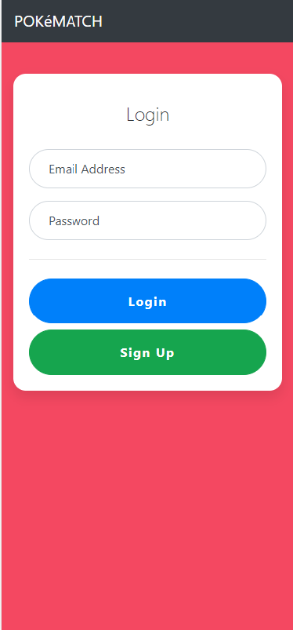
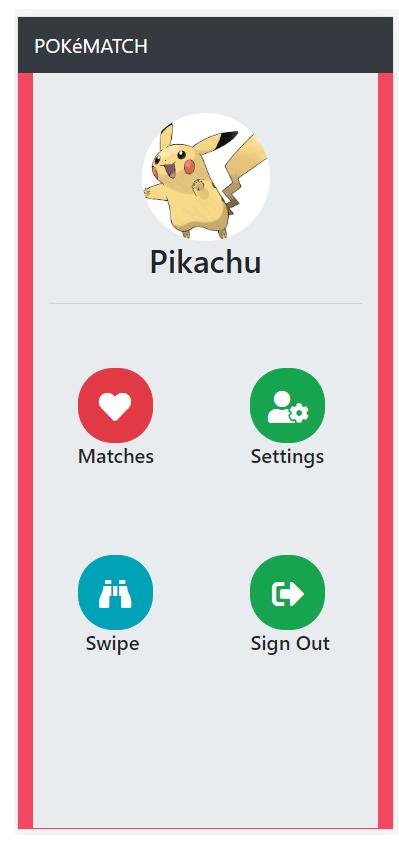
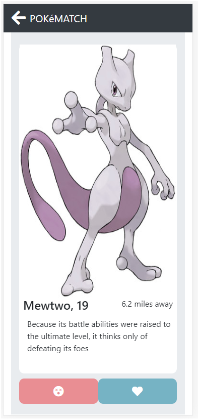
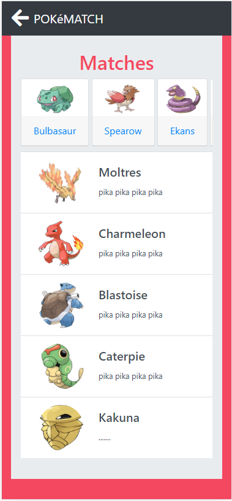
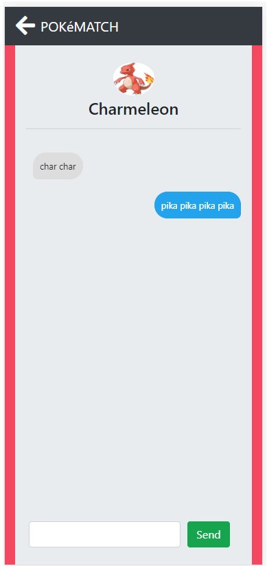
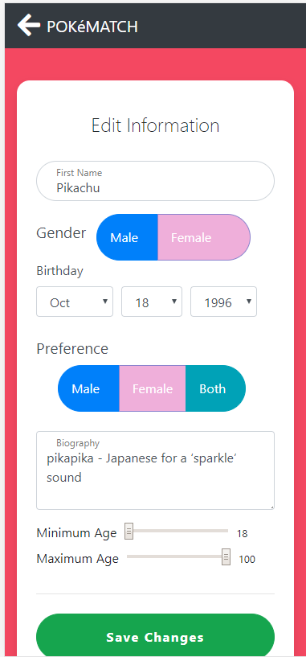

# pokematch

Users are able to create an account

Functionality similar to tinder or bumble

Users are able to swipe with a touch screen

Matching only happens when two users both swipe right

Messaging is only between two users that have both matched

Users are able to change various settings and information 

